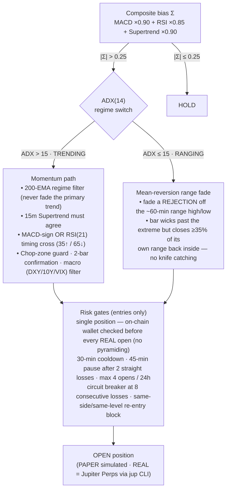

# Cortex Alpha — Solana Trade Classifier

A quantitative trading dashboard + autonomous trading daemon for SOL perpetuals. A composite
technical bias (MACD + RSI + Supertrend) drives a **regime-switched** strategy — momentum when the
market trends, mean-reversion range-fades when it chops — executed on **Jupiter Perps** via the
`jup` CLI (paper mode by default), with a fully **on-chain-verified trade journal**.

- **Full strategy write-up:** [docs/STRATEGY.md](docs/STRATEGY.md)
- **Backtest methodology & results:** [STRATEGY_RESULTS.md](STRATEGY_RESULTS.md)
- **API reference:** [docs/API.md](docs/API.md) · **Testing:** [docs/TESTING.md](docs/TESTING.md)

> ⚠️ Backtest numbers are in-sample and optimistic. The honest expectation is
> break-even-to-slightly-positive pre-fees. Default execution mode is **PAPER**.

## Entry / exit strategy (automated)

The live auto-trader, the server backtest (`/api/backtest`), and the macro benchmark all share one
code path (`resolveEntry` → `entryGateBlock` → `evaluateExit` in [server.ts](server.ts)), so live
behaviour cannot drift from what was validated.

### Entry — regime-switched



### Exit — volatility-adaptive ATR ladder

All levels are in **price space**, scaled by the ATR captured at entry (floored at 0.4% of price so
a quiet tape can't put the stop inside minute-to-minute noise). Long shown; short mirrors.

```
entry + 4.0×ATR ── HARD TP CAP ──────── close the runner
peak  − 2.0×ATR ── TRAILING STOP ────── ratchets behind the best price (favorable-only)
entry + 1.5×ATR ── SCALE-OUT 50% ────── bank half, move stop to breakeven → risk-free runner
entry           ── BREAKEVEN STOP ───── (after the scale-out)
entry − 1.5×ATR ── INITIAL HARD STOP ── loss cap from the first tick
```

Two additional exits live outside the ladder:

- **Time limit** — no scale-out and still under +0.5% after 90 minutes → cut it.
- **In-profit reversal** — the signal flips *and* the trade has cleared a ≥1.5% fee/noise buffer →
  bank it and re-enter the opposite side. A flip while under water is ignored; the stop governs the
  downside (prevents fee-eaten micro-loss churn).

Multipliers are env-tunable: `EXIT_SL_MULT` (1.5), `EXIT_PARTIAL_MULT` (1.5), `EXIT_PARTIAL_FRAC`
(0.5), `EXIT_TRAIL_MULT` (2.0), `EXIT_TP_MULT` (4.0), `EXIT_MIN_ATR_PCT` (0.4), `ADX_GATE_MIN` (15).

## Trade journal — on-chain verified only

The Journal tab is reconciled against Jupiter's own on-chain trade history (`jup perps history`,
the same feed Phantom reads). **REAL trades only appear once matched to actual on-chain fills** —
fill prices, fees, and realized PnL all come from the chain, never from the bot's own estimates.
Unmatched rows are held back (never shown as "estimated"). Paper and signal-only rows are clearly
labeled as simulated.

## Run locally

**Prerequisites:** Node.js ≥ 20

1. Install dependencies: `npm install`
2. Set `GEMINI_API_KEY` in [.env.local](.env.local) (used for optional news-sentiment scoring)
3. Run the app: `npm run dev` (Vite UI + Express server via `tsx server.ts`)

Other scripts: `npm run build` (production bundle), `npm run lint` (typecheck), `npm test`,
`npx tsx scripts/macro-benchmark.ts` (macro A/B benchmark).
