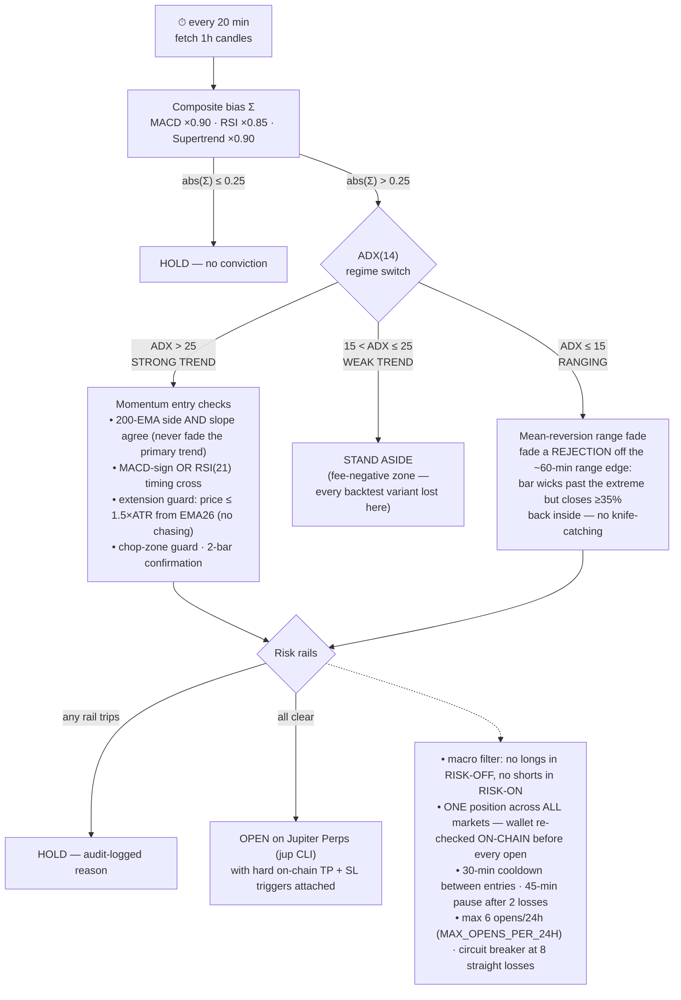
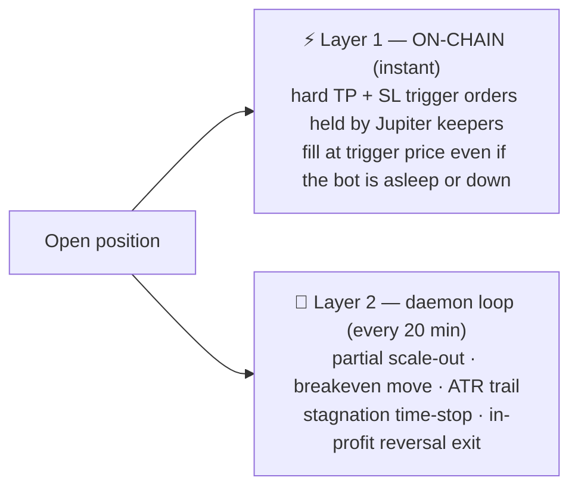

# Cortex Alpha — Solana Trade Classifier

A quantitative trading dashboard + autonomous trading daemon for **SOL perpetuals** (Solana-only
since 2026-08-16; ETH/BTC can be opted back in via `config.tokens`). A composite technical bias
(MACD + RSI + Supertrend) drives a **momentum** strategy that trades only strong trends and stands
aside in chop. It executes on **Jupiter Perps** via the `jup` CLI and keeps a fully
**on-chain-verified trade journal**. The bot holds at most **one position at a time**.
Mean-reversion range fades exist but are **opt-in** (`meanReversionEnabled`). In the Mar–Sep 2026
replay they cut the overall profit factor from 1.38 to 1.12.

- **Full strategy write-up:** [docs/STRATEGY.md](docs/STRATEGY.md)
- **Backtest methodology & results:** [STRATEGY_RESULTS.md](STRATEGY_RESULTS.md)
- **API reference:** [docs/API.md](docs/API.md) · **Testing:** [docs/TESTING.md](docs/TESTING.md)
- **In the app:** the **Strategy** tab opens with an animated playbook of seven scenarios: scale-out and trail, thesis lapse, stop loss, time stop, reversal, adopted orphan, and stand aside. They are played by the live exit rules and parity-tested against `server.ts`.

> ⚠️ Backtest numbers are in-sample and optimistic. The honest expectation is
> break-even-to-slightly-positive pre-fees. Expect **~3–4 trades/week in trending markets and
> near-zero in chop** — long quiet stretches are the strategy working, not the bot being broken
> (check the audit log: it records a reasoned "STAND ASIDE" every cycle).

## The strategy in 30 seconds

Every **20 minutes** the daemon pulls fresh **1-hour candles** and asks four questions:

1. **Is there a directional bias?** A weighted composite Σ of MACD, RSI and Supertrend must exceed
   ±0.25 conviction.
2. **What kind of market is this?** ADX(14) routes the decision: strong trend (>25) → momentum
   entry; anything weaker → **stand aside** (weak-trend entries lost to fees in every backtest
   variant; the ranging-market fade is off by default).
3. **Is the entry safe?** Trend-alignment, no-chasing, macro, cooldown and pyramiding gates all
   have to agree.
4. **If a position is open — manage it.** An ATR-scaled ladder banks half at +1.5×ATR, moves the
   stop to breakeven, and trails the rest. Hard TP/SL live **on-chain** from the moment of entry.
   Once a trade is +1.5% up, it is banked as soon as the signal stops supporting it. If the wallet
   ever holds a position the daemon isn't tracking, the daemon adopts and manages it.

## Timeframes — what interval is used for what

| Timeframe | Used for | Where |
|---|---|---|
| **1h candles** | All signal indicators: composite Σ, ADX(14), RSI, MACD, EMA200, ATR, Supertrend | daemon `interval` (clamped to `1h`/`1d` by `normalizeTradeInterval`) |
| **every 20 min** | Daemon wake-up: evaluate entry signal / manage the open position | `MIN_SYNC_MINUTES` |
| **instant** | Hard TP + SL **trigger orders on-chain** — Jupiter keepers fill them without the bot being awake | attached on every REAL open |
| **2 × 1h bars** | Entry confirmation (current + previous bar must agree on direction) | 2-bar confirmation |
| **last ~60 min** | Range window for the mean-reversion fade (ranging regime only) | `MEAN_REVERSION_LOOKBACK_MINUTES` |
| **8 × 1h bars** | 200-EMA slope measurement (blocks longs into a falling EMA and vice versa) | `REGIME_SLOPE_BARS` |
| **200 × 1h bars (~8 days)** | 200-EMA primary-trend regime (long above / short below) | `useRegimeFilter` |
| **5 days** | Macro regime: DXY / 10-Y yield / VIX trend → RISK-ON / OFF / NEUTRAL | `useMacroFilter` |
| **30 min / 45 min / 6 h** | Entry cooldown / two-loss pause / circuit-breaker auto-reset | risk rails |
| **600 min** | Stagnation time-stop: still under +0.5% and no scale-out → cut it (perps borrow fees accrue hourly even when price goes nowhere). Raised from 360 after the Sep 2026 replay | `STAGNANT_EXIT_MINUTES` |
| **30 days** | Audit-log retention: every daemon decision, exportable as CSV (`/api/audit-log?format=csv`, or the audit panel's Export button) | `AUDIT_RETENTION_DAYS` |
| **rolling 24 h** | Max 6 position opens across all markets | `MAX_OPENS_PER_24H` |
| **per cycle** | Markets scanned when flat: primary token first, then any others in `tokens` | `tokens` (default SOL only) |

**Why 1h and not 5m/15m?** Round-trip fees + hourly borrow cost ~0.35% per trade, while sub-hourly
ATR targets are only ~0.5–0.9% — the Mar–Jul 2026 sweep found **every** sub-hourly entry variant
fee-negative. The server now refuses sub-hourly trading intervals at config load *and* save
(backtest endpoints still accept them for research). A sudden 5-minute reversal is therefore
*entered* late by design (noise-spikes mean-revert; real regime changes last days) — but an **open
position** is still protected instantly by the on-chain triggers (see below).

## Entry pipeline

One shared code path (`resolveEntry` → `entryGateBlock`) drives the live trader, the server
backtest and the macro benchmark, so live behaviour cannot drift from what was validated.



## Exit ladder — volatility-adaptive, in price space

All levels scale with the ATR captured at entry (floored at 0.4% of price so a quiet tape can't
place the stop inside noise). Long shown; short mirrors.

```
entry + 4.0×ATR ── HARD TP CAP ──────── close the runner
peak  − 2.0×ATR ── TRAILING STOP ────── ratchets behind the best price (favorable-only)
entry + 1.5×ATR ── SCALE-OUT 50% ────── bank half, move stop to breakeven → risk-free runner
entry           ── BREAKEVEN STOP ───── (after the scale-out)
entry − 1.5×ATR ── INITIAL HARD STOP ── loss cap, live ON-CHAIN from the first second
```

Two additional exits live outside the ladder:

- **Stagnation time-stop** — no scale-out and still under +0.5% (leveraged) after **10 hours** →
  cut it before borrow fees eat it (a 19h "flat" short once realized −1.89% purely from fees).
- **Signal exit** — once the trade has cleared a ≥1.5% fee/noise buffer, bank it when the signal
  **flips** (reversal, may re-enter the other side) **or falls back to HOLD** (thesis lapse). A
  signal change while under the buffer is ignored; the stop governs the downside.

## What if the market flips violently between checks?

Two independent protection layers with different reaction speeds:



A 5-minute crash against your position hits the Layer-1 stop within seconds. What the 1h interval
changes is only how quickly a **new** trend is *entered* — deliberately slow, because 5-minute
"trend changes" are usually noise and the fees on trading them are what historically lost money.

## Execution & journal

- `tradingMode` **PAPER** simulates everything; **REAL** executes on Jupiter Perps via the `jup`
  CLI (`executeOnChainTradeServerSide`), sized by `positionSizeUsd` (default **$20** notional;
  collateral = size ÷ leverage, Jupiter requires ≥ $10 collateral) at ≤ `MAX_LEVERAGE` (5) — or by
  `allocationPercent` if `positionSizeUsd` is 0.
- **Trade journal is on-chain-verified only:** REAL trades appear only once matched to actual
  on-chain fills from `jup perps history` — prices, fees and PnL come from the chain, never from
  the bot's own estimates. Paper/signal rows are clearly labeled simulated.

## ⚠️ Ops: deploys reset the daemon

Railway has no persistent volume — **every deploy resets the daemon state from the repo's seed
[jupiter_config_state.json](jupiter_config_state.json), which ships `enabled: false`**. After each
push, re-enable the bot (dashboard toggle or `POST /api/jupiter-config {"enabled":true}`) and
sanity-check `interval`/`positionSizeUsd` via `GET /api/jupiter-config`. The pre-open on-chain
position check makes a mid-trade restart safe (it can't double exposure), but the local tracker of
an open position is lost across deploys.

## Run locally

**Prerequisites:** Node.js ≥ 20

1. Install dependencies: `npm install`
2. Set `GEMINI_API_KEY` in [.env.local](.env.local) (used for optional news-sentiment scoring)
3. Run the app: `npm run dev` (Vite UI + Express server via `tsx server.ts`)

Other scripts: `npm run build` (production bundle), `npm run lint` (typecheck), `npm test`,
`npx tsx scripts/macro-benchmark.ts` (macro A/B benchmark).
